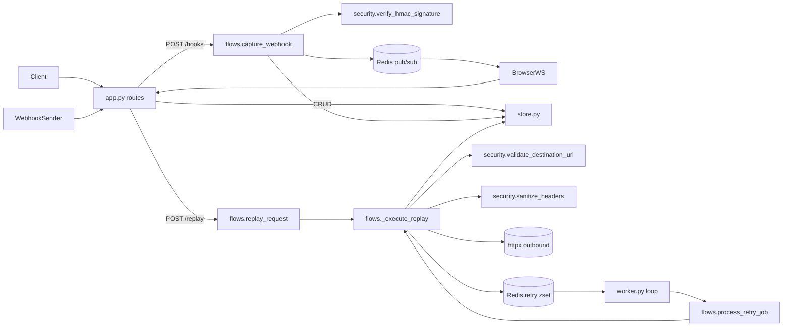

# Relay

Relay is a full-stack webhook inspector: capture inbound webhook requests, inspect headers/body/query in real time, replay safely, and view delivery history.

## Backend architecture

The backend is intentionally flat and small: `backend/app.py`, `backend/flows.py`, `backend/store.py`, `backend/security.py`, and `backend/worker.py`.  
`app.py` is the HTTP and WebSocket surface, `flows.py` orchestrates capture/replay/retry behavior, `store.py` owns SQLAlchemy models and DB access, `security.py` contains trust-boundary checks, and `worker.py` only runs the retry loop.  
Each captured webhook is stored in Postgres and also published to Redis pub/sub so clients receive live events without polling.  
Replay attempts are persisted, and failures/5xx responses are queued in Redis sorted-set retries with exponential backoff.  
Session IDs isolate endpoint/request visibility per browser session.



## Optional webhook signing (HMAC-SHA256)

Webhook signing is optional per endpoint.  
By default, endpoints are easy-mode (`require_signature = false`) so regular users can send test webhooks without crypto setup.  
If you enable signing (`require_signature = true` when creating an endpoint), Relay returns a secret and requires `x-webhook-signature` on incoming webhook requests.

Who should enable it:
- Production systems receiving events from third parties (payments, billing, commerce, internal event buses).
- Teams that need to prove request authenticity and detect tampering.

How it works:
1. Sender computes `hex(HMAC_SHA256(secret, raw_request_body_bytes))`.
2. Sender sends that hex digest in `x-webhook-signature`.
3. Relay recomputes expected signature from the stored endpoint secret and raw body.
4. Relay compares with constant-time comparison (`hmac.compare_digest`).
5. Missing/invalid signature returns `401`.

Why this is secure:
- **Authenticity:** only parties with the shared secret can generate a valid signature.
- **Integrity:** body changes in transit produce a different signature and are rejected.
- **Timing attack resistance:** constant-time comparison reduces leak risk during signature checking.

Note: HMAC does not encrypt payloads; use HTTPS for transport confidentiality.

## Route mapping

- `GET /health` -> DB and Redis health checks
- `POST /api/endpoints`, `GET /api/endpoints`, `DELETE /api/endpoints/{id}` -> endpoint CRUD
- `GET /api/endpoints/{id}/requests` -> list captured requests for an endpoint
- `GET /api/requests/{id}`, `DELETE /api/requests/{id}`, `GET /api/requests/{id}/attempts` -> request detail/history/delete
- `POST /api/requests/{id}/replay` -> replay + retry enqueue behavior
- `GET|POST|PUT|PATCH|DELETE /hooks/{endpoint_id}` -> webhook ingress capture
- `WS /ws/endpoints/{endpoint_id}` -> real-time stream via Redis pub/sub

## Tech stack

FastAPI, Python, PostgreSQL, SQLAlchemy, Alembic, Redis, React, TypeScript, Vite, pytest, GitHub Actions, Render

## Live demo

[https://webhook-inspector-sx1y.onrender.com](https://webhook-inspector-sx1y.onrender.com)

## Run locally

```bash
git clone https://github.com/alexh212/webhook-inspector
cd webhookinspector

# Backend
cd backend
python -m venv venv && source venv/bin/activate
pip install -r requirements.txt
cp .env.example .env
alembic upgrade head
uvicorn app:app --reload

# Worker (separate terminal)
python worker.py

# Frontend (separate terminal)
cd ../frontend
npm install && npm run dev
```

## Tests

```bash
cd backend && pytest tests/ -v
```

## Environment variables

```bash
# backend (.env)
DATABASE_URL=postgresql+asyncpg://localhost/webhookinspector
REDIS_URL=redis://localhost:6379
ALLOWED_ORIGINS=http://localhost:5173,http://localhost:5174
DEBUG=false                          # optional, enables SQLAlchemy query logging

# frontend (.env)
VITE_API_URL=http://localhost:8000   # optional, defaults to localhost:8000
```
