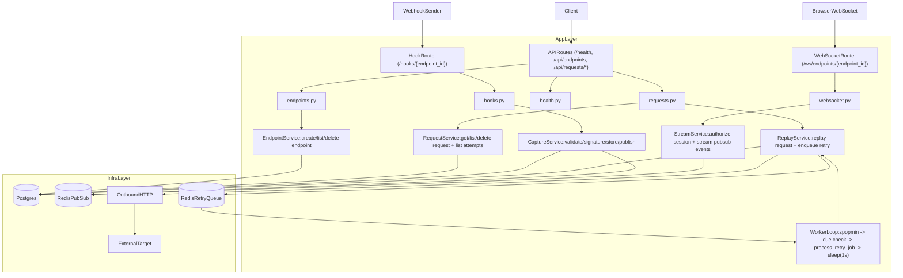

# Backend Flow

## Route to service mapping

- `GET /health` -> `health.py` (DB + Redis checks)
- `POST /api/endpoints`, `GET /api/endpoints`, `DELETE /api/endpoints/{id}` -> `EndpointService`
- `GET /api/endpoints/{id}/requests`, `GET /api/requests/{id}`, `DELETE /api/requests/{id}`, `GET /api/requests/{id}/attempts` -> `RequestService`
- `POST /api/requests/{id}/replay` -> `ReplayService`
- `GET|POST|PUT|PATCH|DELETE /hooks/{endpoint_id}` -> `CaptureService`
- `WS /ws/endpoints/{endpoint_id}` -> stream service logic in `websocket.py`
