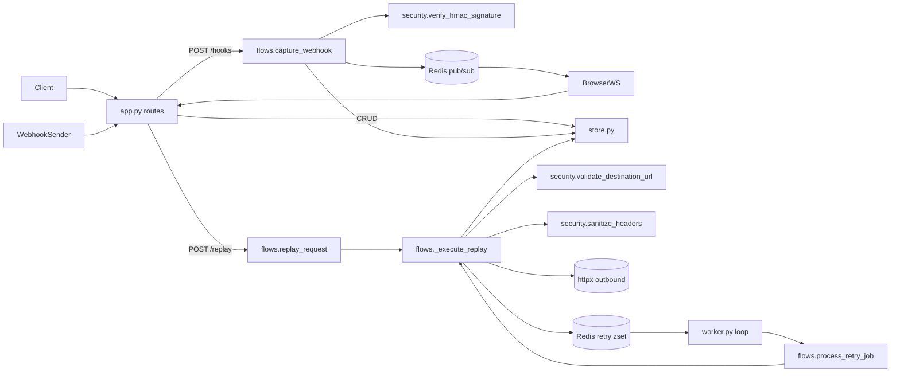

# Backend Architecture

The backend is five flat modules at `backend/`. A request enters `app.py`, which holds the FastAPI app, middleware, dependencies, pydantic models, and every route. Thin handlers either call a `store.py` query helper for plain CRUD or a `flows.py` function for orchestrated work (capture, replay). `flows.py` delegates trust-boundary checks (SSRF, HMAC, hop-by-hop stripping) to `security.py` and persistence to `store.py`. The retry `worker.py` runs the same `flows.process_retry_job` that the replay API would run, so the API and the worker share one execution path. Redis is used for two things only: pub/sub fan-out to WebSocket subscribers on capture, and a sorted-set retry queue scored by due-time.

## Request, replay, and worker flow

## Route to flow to store mapping

| Route | Handler in `app.py` | Flow (`flows.py`) | Store (`store.py`) |
| --- | --- | --- | --- |
| `GET /health` | `health` | — | `db.execute("SELECT 1")` + `redis_client.ping` |
| `POST /api/endpoints` | `create_endpoint` | — | `create_endpoint` |
| `GET /api/endpoints` | `list_endpoints` | — | `list_endpoints` |
| `DELETE /api/endpoints/{id}` | `delete_endpoint` | — | `delete_endpoint` |
| `GET /api/endpoints/{id}/requests` | `list_endpoint_requests` | — | `list_requests` |
| `GET /api/requests/{id}` | `get_request_details` | — | `get_request` |
| `GET /api/requests/{id}/attempts` | `list_request_attempts` | — | `list_attempts` |
| `DELETE /api/requests/{id}` | `delete_endpoint_request` | — | `delete_request` |
| `POST /api/requests/{id}/replay` | `replay_endpoint_request` | `replay_request` -> `_execute_replay` -> `enqueue_retry` | `get_request_or_404`, `assert_request_session_access`, `add_delivery_attempt` |
| `* /hooks/{id}` | `capture_hook` | `capture_webhook` | `get_endpoint_or_404`, `add_captured_request` |
| `WS /ws/endpoints/{id}` | `websocket_feed` | — | `get_endpoint` |

## Worker

`worker.py` runs `redis_client.zpopmin` against `RETRY_QUEUE_KEY`. Jobs whose due-time is in the future are reinserted unchanged. Due jobs are passed to `flows.process_retry_job`, which validates the destination URL, fetches the captured request, calls `_execute_replay`, persists a `DeliveryAttempt`, and re-enqueues with `attempt_number + 1` on error or 5xx (capped at `MAX_RETRIES = 5`, exponential backoff `5 ** attempt`).

## Design rules

- `app.py` is the only HTTP/WS surface. Handlers stay thin: parse inputs, call a flow or a store helper, shape the response.
- `flows.py` owns multi-step orchestration. The replay path is shared by the API entry point and the worker entry point via one private `_execute_replay` and one `_should_retry`.
- `store.py` owns every DB read and write, including the SQLAlchemy models and session factory. Routes never construct queries.
- `security.py` owns trust-boundary primitives only: SSRF blocklist, HMAC signature verification, hop-by-hop header stripping. Any diff here is security-relevant by definition.
- `worker.py` is the retry loop and nothing else.
