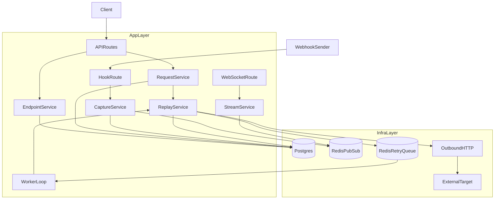

# Backend Flow

```mermaid
flowchart TD
client[Client] --> apiRoutes[APIRoutes]
webhookSender[WebhookSender] --> hookRoute[HookRoute]

subgraph appLayer [AppLayer]
apiRoutes --> endpointService[EndpointService]
apiRoutes --> requestService[RequestService]
hookRoute --> captureService[CaptureService]
wsRoute[WebSocketRoute] --> streamService[StreamService]
workerLoop[WorkerLoop] --> replayService[ReplayService]
requestService --> replayService
end

subgraph infraLayer [InfraLayer]
endpointService --> db[(Postgres)]
requestService --> db
captureService --> db
replayService --> db
captureService --> redisPub[(RedisPubSub)]
streamService --> redisPub
replayService --> redisQueue[(RedisRetryQueue)]
redisQueue --> workerLoop
replayService --> outboundHttp[OutboundHTTP]
outboundHttp --> target[ExternalTarget]
end
```
